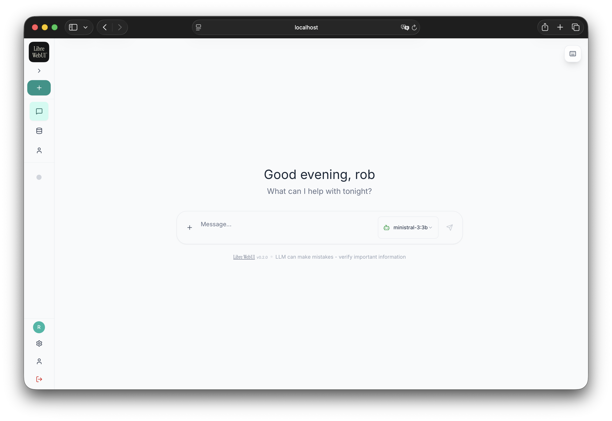
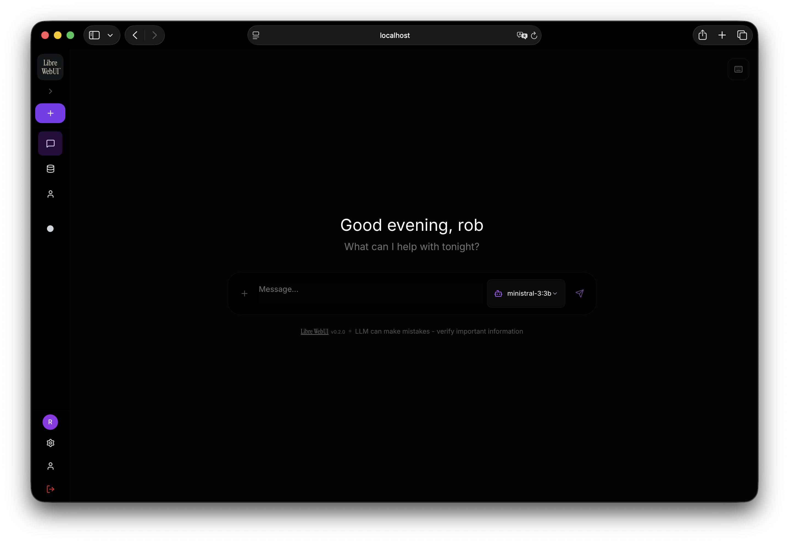

<div align="center">

# Libre WebUI

### Privacy-First AI Chat Interface

<p align="center">
  <strong>Self-hosted • Open Source • 500+ AI Models</strong>
</p>

<p>
  
  
  
</p>

<p align="center">
  
  
  
</p>

[Website](https://librewebui.org) • [Documentation](https://docs.librewebui.org) • [Get Started](#-quick-start)

</div>

---

## Why Libre WebUI?

A stunning, modern interface for AI chat that puts **you** in control. Run it locally with Ollama, connect to OpenAI, Anthropic, or any of 9+ providers—all from one beautiful UI.

- **Your data stays yours** — Zero telemetry, fully self-hosted
- **One interface, 500+ models** — Ollama, GPT-4, Claude, Gemini, and more
- **Built for productivity** — Keyboard shortcuts, dark mode, responsive design

---

## Features

<table>
<tr>
<td width="50%">

### Core Experience

- Real-time streaming chat
- Beautiful dark/light themes
- VS Code-style keyboard shortcuts
- Mobile-responsive design
- **Native Desktop App** — macOS (Windows & Linux coming soon)

### AI Providers

- **Local**: Ollama (full integration)
- **Cloud**: OpenAI, Anthropic, Google, Groq, Mistral, OpenRouter, and more

</td>
<td width="50%">

### Advanced Capabilities

- **Document Chat (RAG)** — Upload PDFs, chat with your docs
- **Custom Personas** — AI personalities with memory
- **Interactive Artifacts** — Live HTML, SVG, code preview
- **Text-to-Speech** — Multiple voices and providers
- **SSO Authentication** — GitHub, Hugging Face OAuth

### Security

- AES-256-GCM encryption
- Role-based access control
- Enterprise compliance ready

</td>
</tr>
</table>

---

## Quick Start

```bash
# Clone and run
git clone https://github.com/libre-webui/libre-webui
cd libre-webui
npm install && npm run dev
```

**Or with Docker:**

```bash
docker-compose up -d
```

Access at `http://localhost:5173` (dev) or `http://localhost:8080` (Docker)

### Desktop App

Download the native desktop app from [GitHub Releases](https://github.com/libre-webui/libre-webui/releases):

| Platform              | Download         |
| --------------------- | ---------------- |
| macOS (Apple Silicon) | `.dmg` or `.zip` |
| Windows               | Coming soon      |
| Linux                 | Coming soon      |

---

> [!NOTE]
>
> ## Enterprise Services
>
> **Need a custom deployment?** [Kroonen AI, Inc.](https://kroonen.ai) offers professional services for organizations requiring enterprise-grade AI infrastructure.
>
> | What We Offer                                       | Perfect For             |
> | --------------------------------------------------- | ----------------------- |
> | Production deployment (AWS, Azure, GCP, on-premise) | Healthcare (HIPAA)      |
> | SSO integration (Okta, Azure AD, SAML)              | Legal & Finance (SOC 2) |
> | Custom development & integrations                   | Enterprise teams        |
> | Ongoing support & maintenance                       | Research institutions   |
>
> **[Contact Kroonen AI →](https://kroonen.ai/librewebui)**

> [!TIP]
>
> ## Support Development
>
> Libre WebUI is built and maintained independently. Your support keeps it free and open source.
>
> [](https://github.com/sponsors/libre-webui)
>
> **[Become a Sponsor](https://github.com/sponsors/libre-webui)** — Help fund active development

---

## Community

- [Mastodon](https://fosstodon.org/@librewebui) — Follow for updates
- [GitHub Issues](https://github.com/libre-webui/libre-webui/issues) — Bug reports & feature requests
- [Documentation](https://docs.librewebui.org) — Guides & API reference

---

<div align="center">

**Apache 2.0 License** • Copyright © 2025 Libre WebUI

Built by [Kroonen AI](https://kroonen.ai)

</div>
